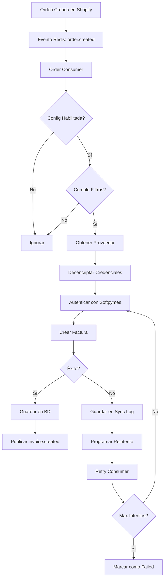

# Módulo de Facturación Electrónica

Módulo para gestionar facturación electrónica a través de proveedores externos (Softpymes, Siigo, etc.).

## 📋 Índice

- [Descripción](#descripción)
- [Arquitectura](#arquitectura)
- [Características](#características)
- [Estructura del Proyecto](#estructura-del-proyecto)
- [Instalación](#instalación)
- [Configuración](#configuración)
- [Uso](#uso)
- [API Endpoints](#api-endpoints)
- [Eventos](#eventos)
- [Testing](#testing)

---

## Descripción

Este módulo permite:

- ✅ Facturar automáticamente órdenes según configuración
- ✅ Soporte para múltiples proveedores de facturación (Softpymes inicial)
- ✅ Configuración granular por integración (Shopify, MercadoLibre, etc.)
- ✅ Reintentos automáticos con exponential backoff
- ✅ Cancelación de facturas
- ✅ Notas de crédito
- ✅ Encriptación de credenciales (AES-256)

---

## Arquitectura

El módulo sigue **Arquitectura Hexagonal (Clean Architecture)**:

```
invoicing/
├── bundle.go                    # Ensamblador del módulo
└── internal/
    ├── domain/                  # 🔵 DOMINIO (núcleo puro)
    │   ├── entities/            # Entidades sin dependencias externas
    │   ├── dtos/               # DTOs de dominio
    │   ├── ports/              # Interfaces (contratos)
    │   ├── errors/             # Errores de dominio
    │   └── constants/          # Constantes
    │
    ├── app/                     # 🟢 APLICACIÓN (casos de uso)
    │   ├── constructor.go
    │   ├── create_invoice.go
    │   ├── cancel_invoice.go
    │   ├── retry_invoice.go
    │   └── ...
    │
    └── infra/                   # 🔴 INFRAESTRUCTURA (adaptadores)
        ├── primary/             # Adaptadores de entrada
        │   ├── handlers/        # HTTP handlers
        │   └── queue/          # Consumers
        │       └── consumer/
        │           ├── order_consumer.go
        │           └── retry_consumer.go
        │
        └── secondary/           # Adaptadores de salida
            ├── repository/      # GORM repositories
            ├── providers/       # Clientes de API
            │   └── softpymes/
            ├── queue/          # Event publisher
            └── encryption/     # Encriptación de credenciales
```

### Principios de Arquitectura Hexagonal

1. **Domain** (núcleo):
   - CERO dependencias externas
   - Solo stdlib + tipos primitivos
   - Define interfaces (ports)
   - Sin tags (ni JSON, ni GORM)

2. **Application**:
   - Implementa casos de uso
   - Solo depende de Domain
   - Orquesta la lógica de negocio

3. **Infrastructure**:
   - Implementa los ports de Domain
   - Contiene frameworks y librerías
   - Adaptadores HTTP, DB, APIs externas

---

## Características

### Facturación Automática

- Escucha eventos de órdenes (`order.created`, `order.paid`)
- Valida configuración (`auto_invoice=true`, filtros)
- Factura automáticamente según reglas

### Reintentos Inteligentes

- Máximo 3 intentos
- Exponential backoff: 5 min, 15 min, 60 min
- Consumer de reintentos (cron cada 5 min)

### Seguridad

- Credenciales encriptadas (AES-256)
- Tokens con cache (60 min)
- Validación de business_id

### Extensibilidad

- Soporte para múltiples proveedores
- Nuevos proveedores: implementar `IInvoicingProviderClient`

---

## Estructura del Proyecto

### Domain Layer

```go
// entities/invoice.go - Entidad PURA (sin tags)
type Invoice struct {
    ID              uuid.UUID
    InternalNumber  string
    InvoiceNumber   string
    OrderID         string
    BusinessID      int
    ProviderID      int
    Status          string
    TotalAmount     float64
    // ...
}

// ports/ports.go - Interfaces
type IInvoiceRepository interface {
    Create(ctx context.Context, invoice *entities.Invoice) error
    GetByID(ctx context.Context, id int) (*entities.Invoice, error)
    List(ctx context.Context, filters ListFilters) ([]entities.Invoice, int, error)
    Update(ctx context.Context, invoice *entities.Invoice) error
}

type IInvoicingProviderClient interface {
    CreateInvoice(ctx context.Context, data CreateInvoiceRequest) (*InvoiceResponse, error)
    CancelInvoice(ctx context.Context, invoiceID string) error
    CreateCreditNote(ctx context.Context, data CreateCreditNoteRequest) (*CreditNoteResponse, error)
}
```

### Application Layer

```go
// app/create_invoice.go
func (uc *useCase) CreateInvoice(ctx context.Context, orderID string) (*entities.Invoice, error) {
    // 1. Obtener orden
    // 2. Obtener config de facturación
    // 3. Validar filtros
    // 4. Obtener proveedor
    // 5. Desencriptar credenciales
    // 6. Llamar API del proveedor
    // 7. Guardar factura
    // 8. Publicar evento
}
```

### Infrastructure Layer

```go
// infra/secondary/providers/softpymes/client.go
type Client struct {
    baseURL    string
    httpClient *http.Client
    tokenCache *TokenCache
}

func (c *Client) CreateInvoice(ctx context.Context, req *request.CreateInvoice) (*response.Invoice, error) {
    // Implementación específica de Softpymes
}
```

---

## Instalación

### 1. Migraciones de Base de Datos

```bash
cd /back/migration
go run . up
```

Esto crea las tablas:
- `invoicing_provider_types`
- `invoicing_providers`
- `invoicing_configs`
- `invoices`
- `invoice_items`
- `invoice_sync_logs`
- `credit_notes`

### 2. Seeders

```bash
# Insertar proveedores disponibles
psql -h localhost -p 5433 -U postgres -d probability -f shared/sql/seed_invoicing_providers.sql
```

---

## Configuración

### Variables de Entorno

```env
# Encriptación de credenciales
ENCRYPTION_KEY=your-32-byte-encryption-key-here

# API URLs (opcional, usa defaults)
SOFTPYMES_API_URL=https://api-integracion.softpymes.com.co/app/integration/
```

### Crear Proveedor

```bash
POST /api/v1/invoicing/providers
Content-Type: application/json

{
  "name": "Softpymes - Mi Negocio",
  "provider_type_code": "softpymes",
  "business_id": 1,
  "config": {
    "referer": "900123456",      // NIT del negocio
    "branch_code": "001"          // Código de sucursal
  },
  "credentials": {
    "api_key": "your_api_key",
    "api_secret": "your_api_secret"
  }
}
```

### Configurar Integración

```bash
POST /api/v1/invoicing/configs
Content-Type: application/json

{
  "business_id": 1,
  "integration_id": 5,              // ID de integración (Shopify, etc.)
  "invoicing_provider_id": 1,       // ID del proveedor creado
  "enabled": true,
  "auto_invoice": true,
  "filters": {
    "min_amount": 50000,            // Facturar solo pedidos > $50,000
    "payment_status": "paid"        // Solo pedidos pagados
  }
}
```

---

## Uso

### Facturación Manual

```bash
POST /api/v1/invoicing/invoices
Content-Type: application/json

{
  "order_id": "550e8400-e29b-41d4-a716-446655440000",
  "is_manual": true
}
```

### Cancelar Factura

```bash
POST /api/v1/invoicing/invoices/{invoice_id}/cancel
```

### Reintentar Factura Fallida

```bash
POST /api/v1/invoicing/invoices/{invoice_id}/retry
```

### Crear Nota de Crédito

```bash
POST /api/v1/invoicing/invoices/{invoice_id}/credit-notes
Content-Type: application/json

{
  "amount": 50000,
  "reason": "Devolución parcial por producto defectuoso",
  "note_type": "partial_refund"
}
```

### Listar Facturas

```bash
GET /api/v1/invoicing/invoices?business_id=1&status=issued&page=1&page_size=20
```

---

## API Endpoints

### Proveedores

| Método | Endpoint | Descripción |
|--------|----------|-------------|
| POST | `/api/v1/invoicing/providers` | Crear proveedor |
| GET | `/api/v1/invoicing/providers` | Listar proveedores |
| GET | `/api/v1/invoicing/providers/:id` | Obtener proveedor |
| PUT | `/api/v1/invoicing/providers/:id` | Actualizar proveedor |
| DELETE | `/api/v1/invoicing/providers/:id` | Eliminar proveedor |
| POST | `/api/v1/invoicing/providers/:id/test` | Probar conexión |

### Configuraciones

| Método | Endpoint | Descripción |
|--------|----------|-------------|
| POST | `/api/v1/invoicing/configs` | Crear configuración |
| GET | `/api/v1/invoicing/configs` | Listar configuraciones |
| GET | `/api/v1/invoicing/configs/:id` | Obtener configuración |
| PUT | `/api/v1/invoicing/configs/:id` | Actualizar configuración |
| DELETE | `/api/v1/invoicing/configs/:id` | Eliminar configuración |

### Facturas

| Método | Endpoint | Descripción |
|--------|----------|-------------|
| POST | `/api/v1/invoicing/invoices` | Crear factura |
| GET | `/api/v1/invoicing/invoices` | Listar facturas |
| GET | `/api/v1/invoicing/invoices/:id` | Obtener factura |
| POST | `/api/v1/invoicing/invoices/:id/cancel` | Cancelar factura |
| POST | `/api/v1/invoicing/invoices/:id/retry` | Reintentar factura |
| POST | `/api/v1/invoicing/invoices/:id/credit-notes` | Crear nota de crédito |

### Filtros Disponibles

```
?business_id=1           # Filtrar por negocio
&order_id=UUID           # Filtrar por orden
&status=issued           # pending, issued, cancelled, failed
&integration_id=5        # Filtrar por integración
&page=1                  # Paginación
&page_size=20            # Items por página
```

---

## Eventos

### Eventos Consumidos

El módulo escucha eventos de Redis:

```
probability:orders:events
```

Tipos de eventos procesados:
- `order.created` - Orden creada
- `order.paid` - Orden pagada

### Eventos Publicados

El módulo publica eventos cuando:

```go
// Factura creada exitosamente
{
  "type": "invoice.created",
  "invoice_id": 123,
  "order_id": "uuid",
  "business_id": 1,
  "total_amount": 250000
}

// Factura cancelada
{
  "type": "invoice.cancelled",
  "invoice_id": 123,
  "reason": "Cancelación manual"
}

// Factura fallida (después de máx. intentos)
{
  "type": "invoice.failed",
  "invoice_id": 123,
  "error": "timeout al conectar con proveedor"
}
```

---

## Testing

### Tests Unitarios

```bash
# Ejecutar tests de dominio
go test ./internal/domain/...

# Ejecutar tests de aplicación
go test ./internal/app/...

# Ejecutar todos los tests
go test ./...
```

### Tests de Integración

```bash
# Test de cliente Softpymes
go test ./internal/infra/secondary/providers/softpymes/... -v
```

### Test End-to-End

1. **Configurar proveedor de prueba**
```bash
POST /api/v1/invoicing/providers
{
  "name": "Softpymes Test",
  "provider_type_code": "softpymes",
  "business_id": 1,
  "config": {"referer": "900123456", "branch_code": "001"},
  "credentials": {"api_key": "test_key", "api_secret": "test_secret"}
}
```

2. **Configurar integración**
```bash
POST /api/v1/invoicing/configs
{
  "business_id": 1,
  "integration_id": 5,
  "invoicing_provider_id": 1,
  "enabled": true,
  "auto_invoice": true
}
```

3. **Simular evento de orden**
```bash
redis-cli PUBLISH "probability:orders:events" '{
  "type": "order.created",
  "order_id": "550e8400-e29b-41d4-a716-446655440000",
  "integration_id": 5,
  "business_id": 1,
  "total_amount": 250000
}'
```

4. **Verificar factura creada**
```bash
GET /api/v1/invoicing/invoices?order_id=550e8400-e29b-41d4-a716-446655440000
```

---

## Flujo de Facturación Automática



---

## Estructura de Base de Datos

### Tabla: `invoices`

```sql
CREATE TABLE invoices (
    id SERIAL PRIMARY KEY,
    internal_number VARCHAR(50) UNIQUE NOT NULL,
    invoice_number VARCHAR(50),
    external_id VARCHAR(100),
    cufe VARCHAR(500),
    order_id UUID NOT NULL,
    business_id INTEGER NOT NULL,
    invoicing_provider_id INTEGER NOT NULL,
    integration_id INTEGER,
    status VARCHAR(20) NOT NULL,
    subtotal DECIMAL(15,2) NOT NULL,
    tax DECIMAL(15,2) NOT NULL,
    discount DECIMAL(15,2) DEFAULT 0,
    total_amount DECIMAL(15,2) NOT NULL,
    currency VARCHAR(3) NOT NULL,
    pdf_url TEXT,
    xml_url TEXT,
    issued_at TIMESTAMP,
    cancelled_at TIMESTAMP,
    created_at TIMESTAMP DEFAULT NOW(),
    updated_at TIMESTAMP DEFAULT NOW(),
    UNIQUE(order_id, invoicing_provider_id)
);
```

### Estados de Factura

- `pending` - Factura creada, esperando emisión
- `issued` - Factura emitida exitosamente
- `cancelled` - Factura cancelada
- `failed` - Factura fallida después de reintentos

---

## Reintentos Automáticos

### Estrategia

- **Intento 1**: Inmediato
- **Intento 2**: 5 minutos después
- **Intento 3**: 15 minutos después
- **Intento 4**: 60 minutos después
- **Máximo**: 3 reintentos (4 intentos totales)

### Retry Consumer

El consumer de reintentos se ejecuta cada 5 minutos:

```go
// infra/primary/queue/consumer/retry_consumer.go
func (c *retryConsumer) StartCron(ctx context.Context) {
    ticker := time.NewTicker(5 * time.Minute)
    for range ticker.C {
        logs := c.syncLogRepo.GetPendingRetries(ctx, 10)
        for _, log := range logs {
            c.useCase.RetryInvoice(ctx, log.InvoiceID)
        }
    }
}
```

---

## Agregar Nuevo Proveedor

Para agregar un nuevo proveedor (ej: Siigo):

### 1. Crear Cliente

```go
// infra/secondary/providers/siigo/client.go
package siigo

type Client struct {
    baseURL    string
    httpClient *http.Client
}

func (c *Client) CreateInvoice(ctx context.Context, req *request.CreateInvoice) (*response.Invoice, error) {
    // Implementación específica de Siigo
}
```

### 2. Registrar en Bundle

```go
// bundle.go
func New(...) {
    // ...

    // Softpymes Client
    softpymesClient := softpymes.New(config, logger)

    // Siigo Client
    siigoClient := siigo.New(config, logger)

    // Factory de proveedores
    providerFactory := map[string]ports.IInvoicingProviderClient{
        "softpymes": softpymesClient,
        "siigo": siigoClient,
    }

    // ...
}
```

### 3. Agregar a BD

```sql
INSERT INTO invoicing_provider_types (code, name) VALUES ('siigo', 'Siigo');
```

---

## Troubleshooting

### Factura no se crea automáticamente

1. Verificar que la configuración esté habilitada:
```bash
GET /api/v1/invoicing/configs?business_id=1&integration_id=5
```

2. Verificar filtros de configuración
3. Revisar logs del Order Consumer
4. Verificar eventos en Redis:
```bash
redis-cli SUBSCRIBE "probability:orders:events"
```

### Factura fallida

1. Revisar `invoice_sync_logs`:
```bash
GET /api/v1/invoicing/invoices/{id}/logs
```

2. Verificar credenciales del proveedor
3. Probar conexión:
```bash
POST /api/v1/invoicing/providers/{id}/test
```

### Credenciales no funcionan

1. Verificar que estén encriptadas correctamente
2. Verificar `ENCRYPTION_KEY` en variables de entorno
3. Recrear proveedor con nuevas credenciales

---

## Métricas y Monitoreo

### Métricas Importantes

- Tasa de éxito de facturación
- Tiempo promedio de facturación
- Número de reintentos
- Facturas fallidas por proveedor

### Logs

Todos los logs incluyen:
- `[invoicing]` prefix
- `business_id`
- `order_id`
- `invoice_id`
- Nivel (info, warn, error)

---

## Contribuir

### Reglas de Arquitectura

1. **Dominio**:
   - NUNCA importar frameworks
   - Sin tags en entidades
   - Solo stdlib + tipos primitivos

2. **Aplicación**:
   - Solo depender de domain
   - Implementar lógica de negocio
   - No conocer infraestructura

3. **Infraestructura**:
   - Implementar ports de domain
   - Contener detalles técnicos
   - Adaptadores externos

### Checklist para PRs

- [ ] Entidades sin tags
- [ ] Interfaces en `domain/ports`
- [ ] Tests unitarios
- [ ] Documentación actualizada
- [ ] Sin dependencias cíclicas

---

## Licencia

Propiedad de Probability IA

---

## Contacto

- **Equipo**: Backend Team
- **Documentación**: `/docs/invoicing/`
- **Issues**: Jira Board

---

**Última actualización**: 2026-01-31
